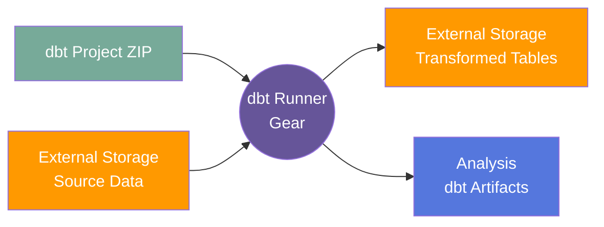

# dbt Runner

## Overview

*[Getting Started Guide with DBT](docs/getting_started_with_dbt.md)*

*[Usage](#usage)*

### Summary

The dbt Runner gear enables users to run dbt (data build tool) projects on Flywheel
datasets stored in external storage. It transforms source parquet files into modeled
data tables using user-defined dbt transformations, outputting the results back to
external storage.

### Cite

N/A

### License

*License:* MIT

### Classification

*Category:* Analysis

*Gear Level:*

- [ ] Project
- [ ] Subject
- [ ] Session
- [ ] Acquisition
- [x] Analysis

----

[[_TOC_]]

----

### Inputs

- **dbt_project_zip**
  - __Name__: dbt Project Archive
  - __Type__: archive (zip file)
  - __Optional__: No
  - __Description__: Zip file containing a complete dbt project with dbt_project.yml,
    profiles.yml, models/, and other required dbt files
  - __Notes__: The dbt project should be tested locally before uploading. Must use
    dbt-duckdb adapter.

### Config

- **storage_label**
  - __Name__: Storage Label
  - __Type__: string
  - __Description__: Label of the Flywheel external storage containing source and
    output data
  - __Default__: N/A (required)

- **source_prefix**
  - __Name__: Source Prefix
  - __Type__: string
  - __Description__: Path prefix within external storage where source Flywheel
    dataset files are located (do not include trailing slash)
  - __Default__: N/A (required)

- **output_prefix**
  - __Name__: Output Prefix
  - __Type__: string
  - __Description__: Path prefix within external storage where transformed output
    tables will be written (do not include trailing slash)
  - __Default__: N/A (required)

- **debug**
  - __Name__: Debug Mode
  - __Type__: boolean
  - __Description__: Log debug messages
  - __Default__: false

### Outputs

#### Files

The gear saves dbt artifacts as gear outputs:

- **manifest.json** - Complete dbt project manifest with model metadata
- **run_results.json** - Results from the dbt run execution
- **sources.json** - Source metadata and freshness information
- **compiled/** - Directory containing compiled SQL for all models

Transformed data tables are written directly to the specified output prefix in
external storage.

#### Metadata

No metadata is written to Flywheel containers.

### Pre-requisites

#### Prerequisite Gear Runs

None - this gear operates independently on external storage.

#### Prerequisite Files

1. **Source Dataset**
   - Origin: Exported from Flywheel via dataset export
   - Location: External storage at the specified source_prefix
   - Format: Flywheel dataset schema (tables/ directory with parquet files)

#### Prerequisite Metadata

None required.

## Usage

This section provides a detailed description of how the gear works in Flywheel.

### Description

The dbt Runner gear executes a complete dbt project workflow:

1. **Validation** - Validates configuration parameters, dbt project structure, and
   storage access
2. **Download** - Downloads source dataset from external storage
3. **Transform** - Runs dbt transformations using dbt-duckdb adapter
4. **Upload** - Uploads transformed results back to external storage
5. **Archive** - Saves dbt artifacts (manifest, run results) as gear outputs

The gear uses the dbt-duckdb adapter to process data locally within the gear
container, enabling fast transformations on parquet files without requiring a
separate database.

#### File Specifications

##### dbt_project_zip

The dbt project zip file must contain:

- **dbt_project.yml** - Project configuration defining project name, version,
  and model settings
- **profiles.yml** - dbt profile configuration for dbt-duckdb adapter
- **models/** - Directory containing dbt model SQL files
- Optional: macros/, seeds/, tests/, snapshots/, analyses/ directories

**Important Requirements:**

- Must use dbt-duckdb adapter (specified in profiles.yml)
- Project should be tested locally before deployment
- **Directory Structure**: Source data paths must use `../source_data/` prefix
  - The gear downloads data to a `source_data/` directory that is a **sibling**
    (not child) of the dbt project directory
  - All model references to source data must use relative paths: `../source_data/tables/...`
  - When testing locally, create the same structure: place `source_data/` in the
    parent folder of your dbt project

**Example profiles.yml:**

```yaml
my_project:
  target: dev
  outputs:
    dev:
      type: duckdb
      path: 'target/dev.duckdb'
      threads: 4
      extensions:
        - parquet
```

**Directory Structure (Local and Gear):**

```text
parent_folder/                    # Your workspace (or gear work directory)
├── my_dbt_project/               # Your dbt project
│   ├── dbt_project.yml
│   ├── profiles.yml
│   └── models/
└── source_data/                  # Data directory (sibling to project)
    └── tables/
        ├── subjects/*.parquet
        └── sessions/*.parquet
```

**Example Model SQL:**

```sql
-- models/staging/stg_subjects.sql
SELECT *
FROM read_parquet('../source_data/tables/subjects/*.parquet')
```

**Note:** The `../source_data/` path references the parent directory where
source data is located, ensuring consistency between local testing and gear execution.

### Workflow



**Workflow Steps:**

1. Upload dbt project zip file to Flywheel (attach to any container)
2. Configure gear with storage_label, source_prefix, and output_prefix
3. Run gear (typically at Analysis level)
4. Gear validates inputs and downloads source data
5. Gear executes dbt transformations
6. Transformed tables are uploaded to external storage at output_prefix
7. dbt artifacts are saved to the Analysis container

### Use Cases

#### Use Case 1: Creating Analytics Tables

**Conditions:**

- [x] dbt project has been tested locally with sample data
- [x] Source dataset exists in external storage (Flywheel dataset export)
- [x] dbt models reference source parquet files correctly
- [ ] Models require incremental updates (not supported in v0.1.0)

**Description:**

A data analyst has created dbt models to join subjects, sessions, and acquisitions
tables with file metadata to create enriched analytics tables. They test the project
locally using a sample dataset, then upload the dbt project zip to Flywheel and run
the gear against the full production dataset in external storage. The gear executes
all transformations and writes the final tables back to external storage for
downstream analysis.

#### Use Case 2: Debugging Transformation Logic

**Conditions:**

- [x] Previous dbt run produced unexpected results
- [x] Need to inspect compiled SQL and execution details
- [x] dbt artifacts (manifest.json, run_results.json) are needed

**Description:**

A data engineer notices unexpected results from a dbt transformation. They download
the manifest.json and run_results.json artifacts from the Analysis output to review
the compiled SQL and understand which models succeeded or failed. They can trace
through the lineage and identify the issue before updating their dbt project.

### Logging

The gear provides detailed logging throughout execution:

- **Validation Phase** - Reports on configuration validation, dbt project structure,
  and storage access
- **Download Phase** - Logs number of files downloaded and their locations
- **dbt Execution** - Shows complete dbt debug and run output
- **Upload Phase** - Reports on files uploaded to external storage
- **Errors** - Detailed error messages with context for troubleshooting

Log output is structured in numbered phases (e.g., [1/7], [2/7]) for easy tracking
of progress.

## Assumptions and Limitations

### Model Output Requirements

- **Upload opt-in via `meta.upload`**: Models must declare
  `meta: {upload: "<path>"}` in their config to be uploaded. The path
  is relative to `target/`. Models without `meta.upload` are not
  uploaded.
- **String paths only**: The `meta.upload` value must be a string.
  Non-string values (e.g. `True`) are logged as a warning and skipped.
- **Subfolder structure**: The `meta.upload` path is used as the
  relative path in external storage. For example,
  `meta: {upload: 'main/summary.parquet'}` uploads to
  `{output_prefix}/main/summary.parquet`.
- **Auto-creation**: Target subdirectories are automatically created
  before dbt runs by scanning model files for location configurations.

### Supported Features

- **Upload control**: Any model that declares `meta.upload` is
  uploaded, regardless of materialization type. This works with
  `external`, `table`, and Python models.
- **dbt adapter**: Only the dbt-duckdb adapter is supported. Other
  adapters (Snowflake, BigQuery, etc.) are not compatible.
- **Data formats**: Source data must be in Parquet format. CSV, JSON,
  and other formats require preprocessing.
- **Dataset schema**: Source data must follow the Flywheel dataset
  schema with a `tables/` directory containing container-level
  subdirectories (subjects/, sessions/, etc.).

### Source Data References

- **Relative paths**: All source data references in dbt models must use
  `../source_data/` prefix (e.g.,
  `read_parquet('../source_data/tables/subjects/*.parquet')`).
- **Directory structure**: The gear creates `source_data/` as a sibling directory
  to the dbt project, not as a child. Local testing should replicate this structure.

### Execution Model

- **Full rebuild**: Each gear run performs a complete rebuild of all models. No
  incremental processing is supported in this version.
- **No state persistence**: The gear does not maintain dbt state between runs.
  Each execution starts fresh.
- **Single-threaded**: While dbt can use multiple threads (configured in
  profiles.yml), all work happens within a single gear container.

### Storage Integration

- **Write permissions**: The gear requires write access to the `output_prefix` in
  external storage.
- **Overwrite behavior**: Existing files at the output location are overwritten
  without warning.
- **No cleanup**: The gear does not remove old output files. Previous runs'
  outputs remain in storage unless manually deleted.

### Known Limitations

- **No incremental models**: Incremental materialization is not supported. All
  models are rebuilt on every run.
- **No seeds support**: dbt seed files are included in the project but not
  actively managed by the gear.
- **No snapshot support**: dbt snapshot functionality is not tested or supported.
- **Limited error recovery**: If dbt run fails mid-execution, partial results are
  not uploaded. The gear returns an error and no outputs are written to external
  storage.
- **File size constraints**: Very large model outputs may encounter memory limits
  within the gear container. Reaching out to Flywheel support is recommended for
  large datasets so that appropriate resources can be allocated.

## Contributing

[For more information about how to get started contributing to that gear,
checkout [CONTRIBUTING.md](CONTRIBUTING.md).]
<!-- markdownlint-disable-file -->
